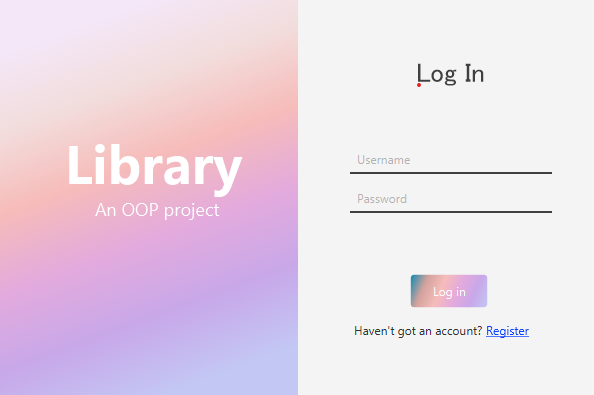
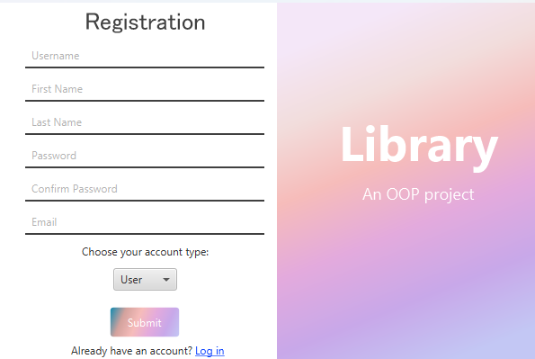
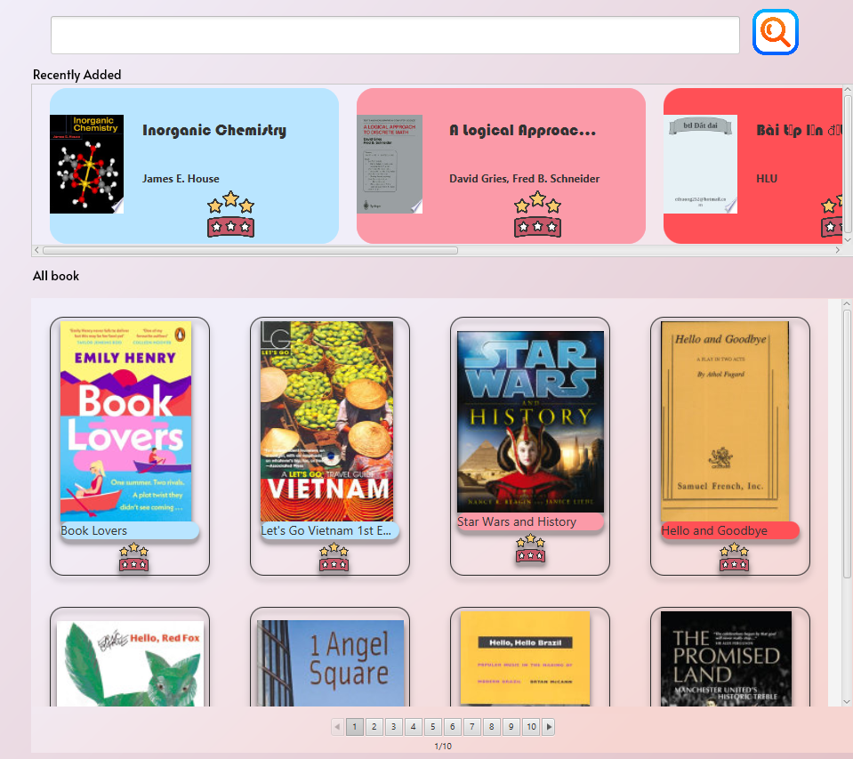
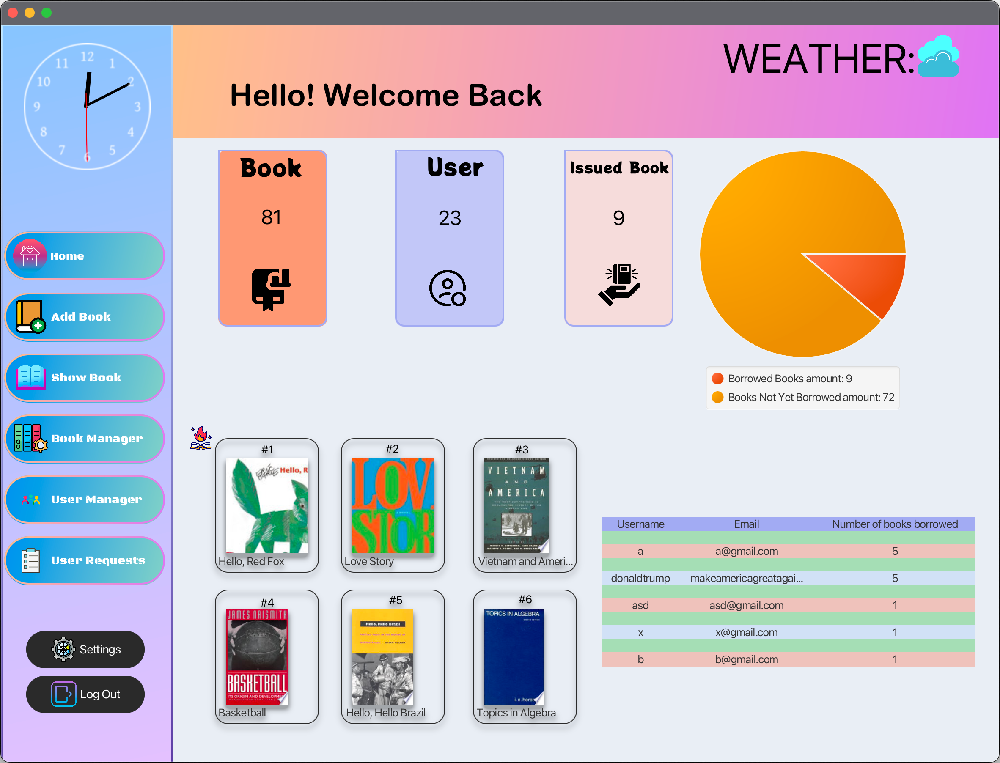
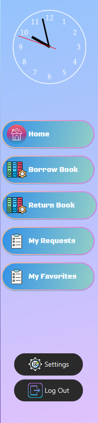
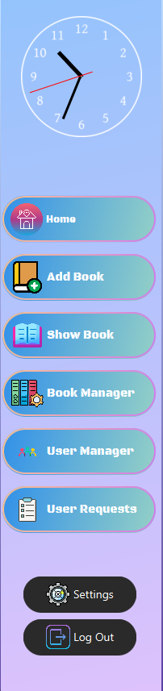
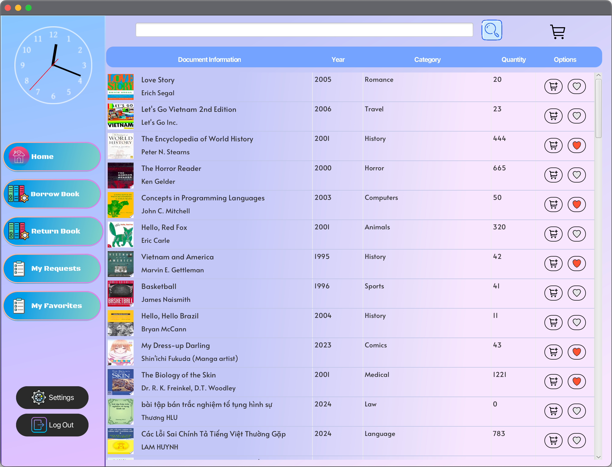
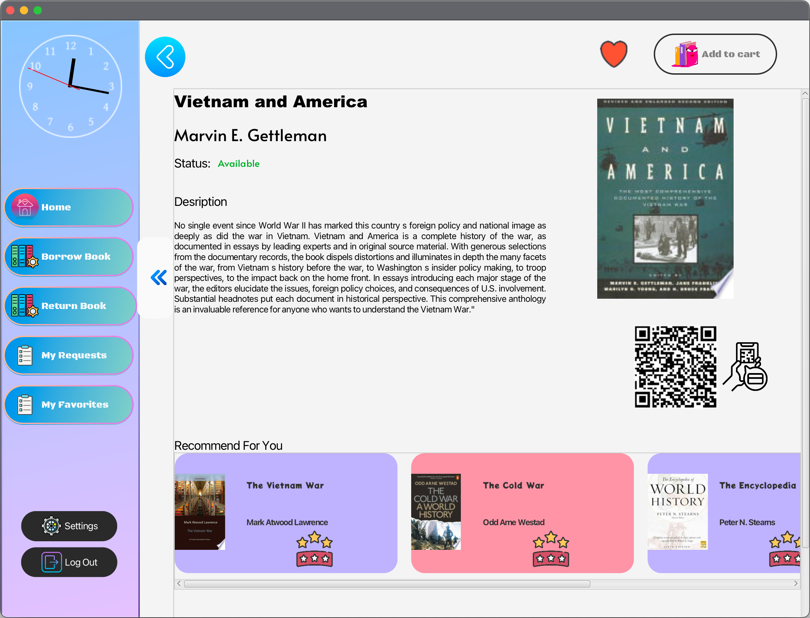
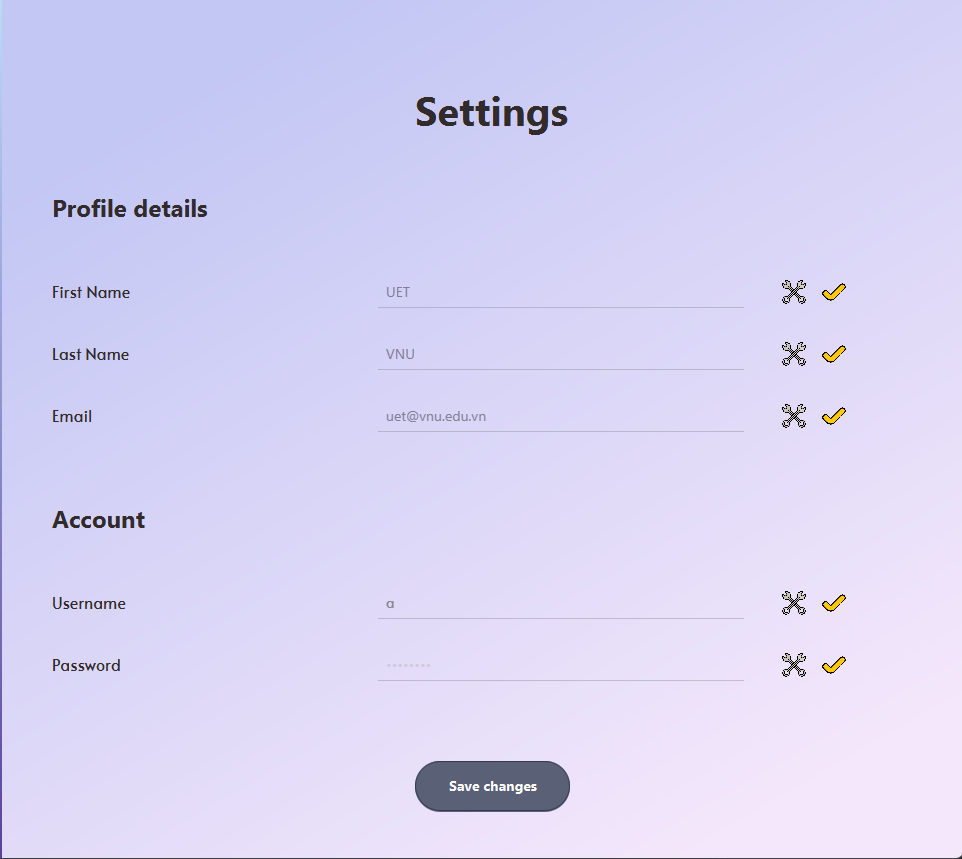

# Table of contents

* [Overview](#overview)
* [Getting started](#getting-started)
* [Screens and features](#screens-and-features)
  * [Register and Log in](#register-and-log-in)
  * [Home screen](#home-screen)
    * [User](#user)
    * [Admin](#admin)
  * [Size bar](#size-bar)
    * [User](#user-1)
    * [Admin](#admin-1)
  * [Show book](#show-book)
  * [Book Detail](#books-detail)
  * [Setting](#setting)
# Overview
This is an online library application to support the real library. You can search and apply to borrow books, when your request is approved you can go directly to the library to borrow. If you cannot borrow, you can add to your favorites to borrow again when the book is available. You can also rate books with comments to the author and other readers.

# Getting started
To use the app, you need to:
* Download or clone source code from this github.
* Install jdk22 or later. (jdk23 recommended).
* Install mysql. Download and add MySQL Connector/J to the project.
* Create a database (you can export sql code from: https://dbdiagram.io/d/OOP-6704a091fb079c7ebdabcbcb).
* Install required dependencies and run.

# Screens and features

## Register and Log in

This screen will appear when you open the app. Here you can login with username and password.

If you haven't have an account, go to register screen by click on "register" on the right-bottom. You can register as admin or user.

## Home screen

After logged in, you will see the home screen. User and Admin have different view on it.

### User

### Admin

## Size bar

  

    
    
<strong>User</strong>

  

  

    
    
<strong>Admin</strong>

  

## Show Book

### User

### Admin

## Book's detail

## Setting

