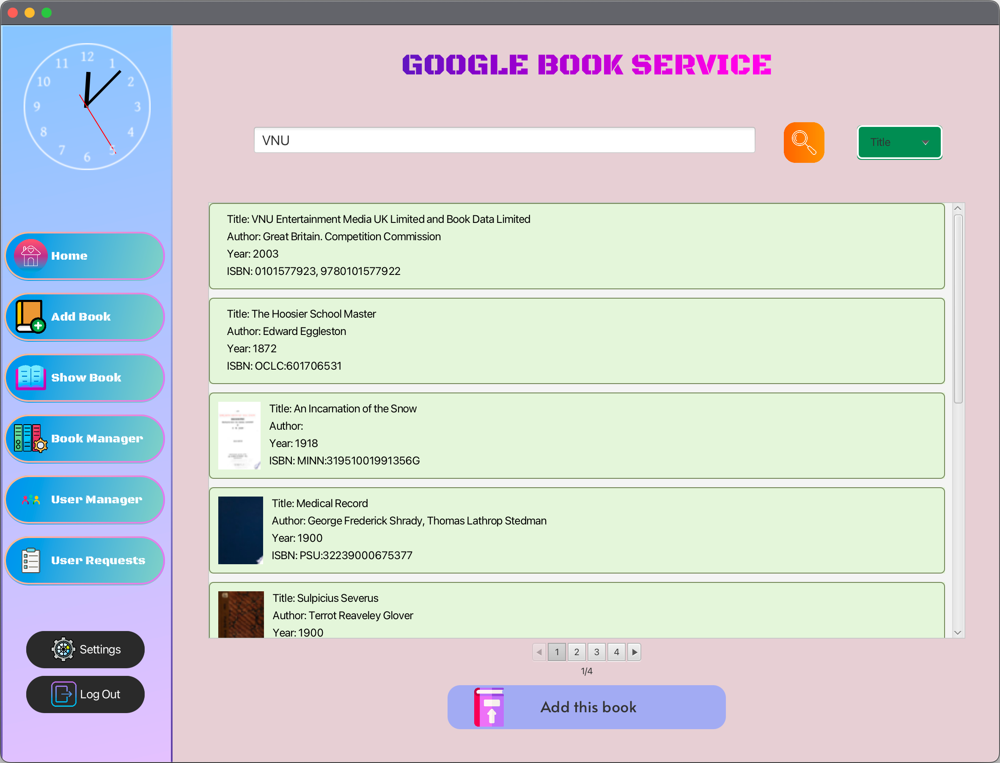

# Table of contents

* [Overview](#overview)
* [Getting started](#getting-started)
* [Screens and features](#screens-and-features)
  * [LogIn](#login)
  * [Register](#register)
  * [Sidebar](#sidebar)
  * [User Features](#user-features)
    * [Home screen](#home-screen)
    * [Show book](#show-book)
    * [Favorites](#favorites)
    * [Borrow and Return Book](#borrow-and-return-book)
  * [Admin Features](#admin-features)
    * [Home screen](#home-screen-1)
    * [Show book](#show-book-1)
    * [Add Book](#add-book)
    * [User Manager](#user-manager)
    * [User Requests](#user-requests)
  * [Setting](#setting)

---

# Overview

Đây là một ứng dụng thư viện trực tuyến được thiết kế để hỗ trợ các thư viện thực tế. Người dùng có thể tìm kiếm và đăng ký mượn sách, và khi yêu cầu được phê duyệt, họ có thể đến thư viện để nhận sách. Nếu sách không có sẵn, người dùng có thể thêm chúng vào danh sách yêu thích để mượn sau. Ứng dụng cũng cho phép người dùng đánh giá sách và để lại bình luận cho tác giả và các độc giả khác.

---

# Getting started

Để sử dụng ứng dụng, bạn cần thực hiện các bước sau:
- Tải xuống hoặc sao chép mã nguồn từ kho GitHub này.
- Cài đặt JDK22 hoặc phiên bản mới hơn (khuyến nghị JDK23).
- Cài đặt MySQL và thêm MySQL Connector/J vào dự án.
- Tạo cơ sở dữ liệu (bạn có thể xuất mã SQL từ [DBDiagram](https://dbdiagram.io/d/OOP-6746b7ffe9daa85acad7c501)).
- Cài đặt các thư viện cần thiết và chạy ứng dụng.
---

# Screens and features

## LogIn

Giao diện nãy sẽ xuất hiện khi bạn khởi động ứng dụng. Bạn có thể đăng nhập bằng cách sử dụng tài khoản và mật khẩu đã khởi tạo trước. Nếu chưa có tài khoản thì bạn có thể đăng kí bằng cách bấm vào nút đăng kí ở phía dưới.

---

## Register

Sau khi bấm vào nút đăng kí, màn hình sau sẽ hiện ra để giúp cho người dùng lập tài khoản mới. Sau khi điền đầy đủ các thông tin và nhập lại đúng mật khẩu thì hệ thống sẽ ghi nhận thông tin tài khoản.

---

## Sidebar

Thanh tính năng sẽ bao gồm những tính năng của User và Admin tùy vào nick của người dùng là gì. Mỗi khi bấm vào một tính năng nào thì màn hình sẽ thay đổi để phù hợp với tính năng đó.

---

## User Features

### Home screen
Màn hình chính của người dùng sẽ hiển thị ra 2 bảng gồm những sách mới được Admin thêm vào và tất cả những cuốn sách đang được chứa trong dữ liệu của thư viện.

Để xem chi tiết của một quyển sách ta chỉ cần bấm vào hình ảnh quyển sách trên màn hình. Ở đây ta có thể đọc các thông tin về sách, trạng thái của sách và có thể thêm sách vào trong danh sách yêu cầu mượn hoặc danh sách yêu thích.

### Show book

Hiện thêm tin của tất cả các sách trong thư viện với những thông tin như bìa sách, thông tin ta giả, năm phát hành, thể loại và số lượng. Bên cạnh đó,người dùng có thể thêm sách vào trong giỏ hàng để có thể gửi yêu cầu mượn sách cho quản trị viên, đồng thời cũng có thể thêm những quyển sách mà mình có hứng thú với vào trong danh sách yêu thích. Cuối cùng để gửi yêu cầu thì người dùng cần bấm vào biểu tượng giỏ hàng bên trên và xác nhận yêu cầu mượn sách của mình.

### Favorites

Ở đây, người dùng có thể xem danh sách những cuốn sách yêu thích của mình và có thể loại ra những quyển sách mà họ cho là không còn hợp lí nữa.

### Borrow and Return Book

#### User Requests

Những yêu cầu mượn sách của người dùng sẽ được hiển thị ở đây. Trạng thái của từng cuốn sẽ được hiện thị để cho người dùng biết quyển sách nào chưa được thông qua hoặc đã được chấp thuận để mượn hay đã được từ chối bởi quản trị viên. Nếu sách đã được chấp thuận thì người dùng cần thêm một thao tác nữa là nhận quyển sách để xác nhận mượn, ngược lại nếu bị từ chối, người dùng có thể gửi lại yêu cầu cho quản trị viên

#### User Return Book

Sau khi mượn thành công, những thông tin về lượt mượn sách sẽ được cập nhập về đây, người dùng có thể trả sách sau khi sử dụng xong. Khi đó người dùng sẽ có thể gửi những đánh giá về cho những người đọc khác.

---

## Admin Features

### Home screen

Màn hình chính của quản trị viên sẽ bao gồm số lượng sách trong thư viện, số lượng người dùng ứng dụng, số quyển sách đang trong quá trình mượn. Hơn nữa, còn có cả best-borrower để có thể biết đường thêm số lượng và có cả ranking những người dùng tích cực nhất trong việc mượn sách.

### Show book

Danh sách thông tin tất cả các quyển sách bao gồm tên sách, mã sách, tên tác giả, năm xuất bản, thể loại và số lượng của quyển đó sẽ được lưu ở đây.

### Add Book

Quản trị viên có thể thêm sách dựa trên tìm kiếm bằng tên sách, tên tác giả hay bằng mã sách rồi có thể điều chỉnh các thông tin về sách một cách tùy ý.

### User Manager

Quản trị viên có thể xem danh sách các người dùng ở đây, đồng thời cũng có thể tùy chỉnh thay đổi thông tin của người dùng hoặc xóa tài khoản đó đi.

### User Requests

Những yêu cầu mượn sách của người dùng sau khi xác nhận sẽ được trả về đây, quản trị viên sẽ có thể xác nhận cho mượn bằng cách bấm vào nút tích hoặc từ chối bằng cách bấm vào nút x.

---

## Setting

Về phần cài đặt thông tin người dùng cũng như tài khoản, chủ sở hữu muốn thay đổi gì thì cần bấm vào cái cờ lê ở bên cạnh để bắt đầu thay đổi, rồi bấm dấu tích để xác nhận đã thay đổi xong. Cuối cùng, để xác nhận những thay đổi về thông tin của mình, chủ sở hữu sẽ bấm nút lưu lại thay đổi.

