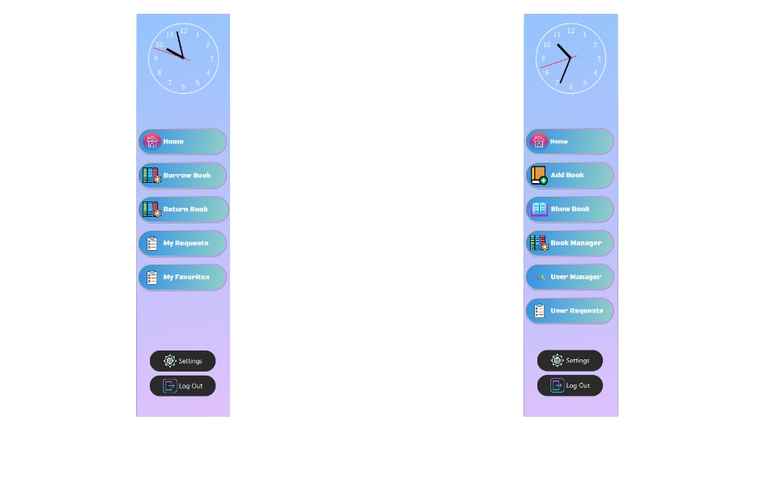
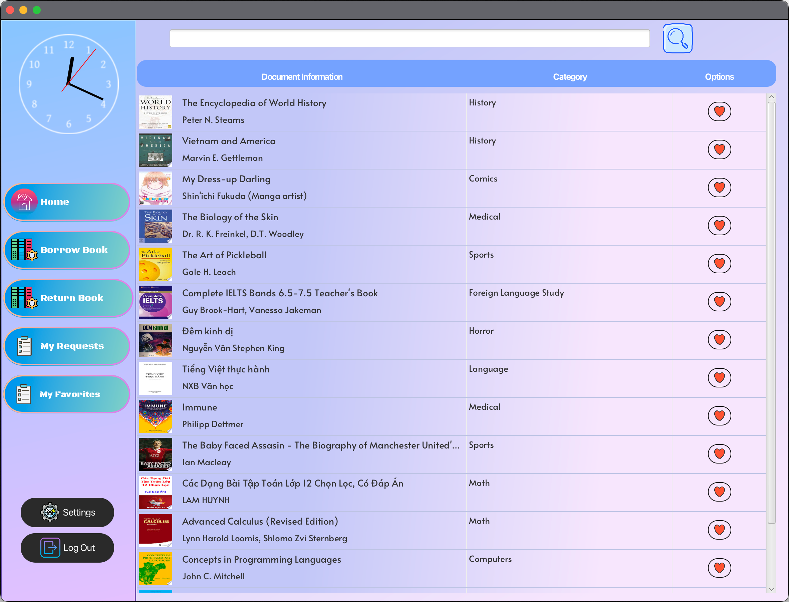

# Table of contents

* [Overview](#overview)
* [Getting started](#getting-started)
* [Screens and features](#screens-and-features)
  * [LogIn](#login)
  * [Register](#register)
  * [Sidebar](#side-bar)
  * [User Features](#user-features)
    * [Home screen](#home-screen)
    * [Show book](#show-book)
    * [Favorites](#favorites)
    * [Borrow and Return Book](#borrow-and-return-book)
  * [Admin Features](#admin-features)
    * [Home screen](#home-screen-1)
    * [Show book](#show-book-1)
    * [Add Book](#add-book)
    * [User Manager](#user-manager)
    * [User Requests](#user-requests)
  * [Setting](#setting)

---

# Overview

Đây là một ứng dụng thư viện trực tuyến được thiết kế để hỗ trợ các thư viện thực tế. Người dùng có thể tìm kiếm và đăng ký mượn sách, và khi yêu cầu được phê duyệt, họ có thể đến thư viện để nhận sách. Nếu sách không có sẵn, người dùng có thể thêm chúng vào danh sách yêu thích để mượn sau. Ứng dụng cũng cho phép người dùng đánh giá sách và để lại bình luận cho tác giả và các độc giả khác.

---

# Getting started

Để sử dụng ứng dụng, bạn cần thực hiện các bước sau:
- Tải xuống hoặc sao chép mã nguồn từ kho GitHub này.
- Cài đặt JDK22 hoặc phiên bản mới hơn (khuyến nghị JDK23).
- Cài đặt MySQL và thêm MySQL Connector/J vào dự án.
- Tạo cơ sở dữ liệu (bạn có thể xuất mã SQL từ [DBDiagram](https://dbdiagram.io/d/OOP-6746b7ffe9daa85acad7c501)).
- Cài đặt các thư viện cần thiết và chạy ứng dụng.
---

# Screens and features

## LogIn

Giao diện nãy sẽ xuất hiện khi bạn khởi động ứng dụng. Bạn có thể đăng nhập bằng cách sử dụng tài khoản và mật khẩu đã khởi tạo trước. Nếu chưa có tài khoản thì bạn có thể đăng kí bằng cách bấm vào nút đăng kí ở phía dưới.

---

## Register

Sau khi bấm vào nút đăng kí, màn hình sau sẽ hiện ra để giúp cho người dùng lập tài khoản mới. Sau khi điền đầy đủ các thông tin và nhập lại đúng mật khẩu thì hệ thống sẽ ghi nhận thông tin tài khoản.

---

## Sidebar

Thanh tính năng sẽ bao gồm những tính năng của User và Admin tùy vào nick của người dùng là gì. Mỗi khi bấm vào một tính năng nào thì màn hình sẽ thay đổi để phù hợp với tính năng đó.

---

## User Features

### Home screen
Màn hình chính của người dùng sẽ hiển thị ra 2 bảng gồm những sách mới được Admin thêm vào và tất cả những cuốn sách đang được chứa trong dữ liệu của thư viện.

Để xem chi tiết của một quyển sách ta chỉ cần bấm vào hình ảnh quyển sách trên màn hình. Ở đây ta có thể đọc các thông tin về sách, trạng thái của sách và có thể thêm sách vào trong danh sách yêu cầu mượn hoặc danh sách yêu thích.

### Show book

### Favorites
Users can add books to their favorites list, making it easy to borrow them later.

### Borrow and Return Book

#### User Requests
Users can request books for borrowing.

#### User Return Book
Users can return borrowed books to the library.

---

## Admin Features

### Home screen
The admin's home screen displays key features for managing the library.

### Show book
Admins can view and manage available books in the system.

### Add Book
Admins can add new books to the system.

### User Manager
Admins can manage user details and access rights.

### User Requests
Admins can view and manage user requests for borrowing books.

---

## Setting

This screen allows users to change their personal information and settings.

# Table of contents

* [Overview](#overview)
* [Getting started](#getting-started)
* [Screens and features](#screens-and-features)
  * [LogIn](#login)
  * [Register](#register)
  * [Side bar](#side-bar)
  * [User Features](#user-features)
    * [Home screen](#user-home-screen)
    * [Show book](#user-show-book)
    * [Favorites](#user-favorites)
    * [Borrow and Return Book](#user-borrow-and-return-book)
  * [Admin Features](#admin-features)
    * [Home screen](#admin-home-screen)
    * [Show book](#admin-show-book)
    * [Add Book](#admin-add-book)
    * [User Manager](#admin-user-manager)
    * [User Requests](#admin-user-requests)
  * [Setting](#setting)

---

# Overview

This is an online library application designed to complement real-world libraries. Users can search and apply to borrow books, and once the request is approved, they can pick up the books from the library. If the books are unavailable, users can add them to their favorites to borrow later. The application also allows users to rate books and leave comments for authors and other readers.

---

# Getting started

To use the app, you need to:
- Download or clone the source code from this GitHub repository.
- Install JDK22 or later (JDK23 recommended).
- Install MySQL and add MySQL Connector/J to the project.
- Create a database (you can export SQL code from [DBDiagram](https://dbdiagram.io/d/OOP-6704a091fb079c7ebdabcbcb)).
- Install the required dependencies and run the application.

---

# Screens and features

## LogIn

This screen appears when you open the app. You can log in using your username and password.

---

## Register

If you don’t have an account, you can go to the register screen by clicking "register" at the bottom right. You can register either as a user or an admin.

---

## Side bar

---

## User Features

### Home screen
The home screen for users displays available books for borrowing.

### Show book
Users can view books available for borrowing from the library.

### Favorites
Users can add books to their favorites list, making it easy to borrow them later.

### Borrow and Return Book

#### User Requests
Users can request books for borrowing.

#### User Return Book
Users can return borrowed books to the library.

---

## Admin Features

### Home screen
The admin's home screen displays key features for managing the library.

### Show book
Admins can view and manage available books in the system.

### Add Book
Admins can add new books to the system.

### User Manager
Admins can manage user details and access rights.

### User Requests
Admins can view and manage user requests for borrowing books.

---

## Setting

This screen allows users to change their personal information and settings.

