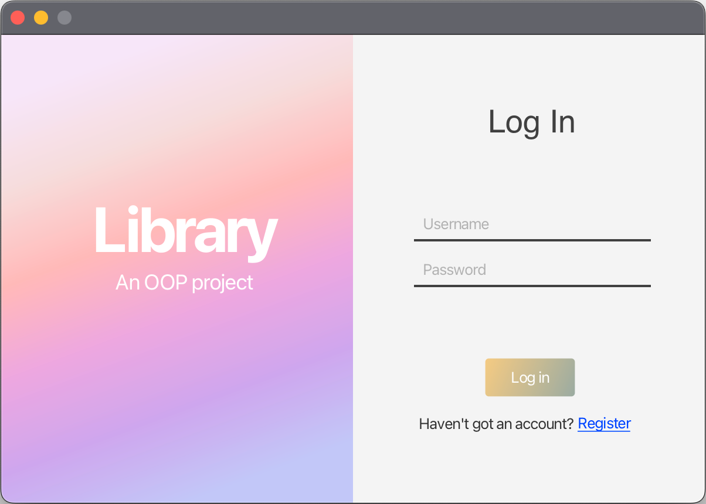
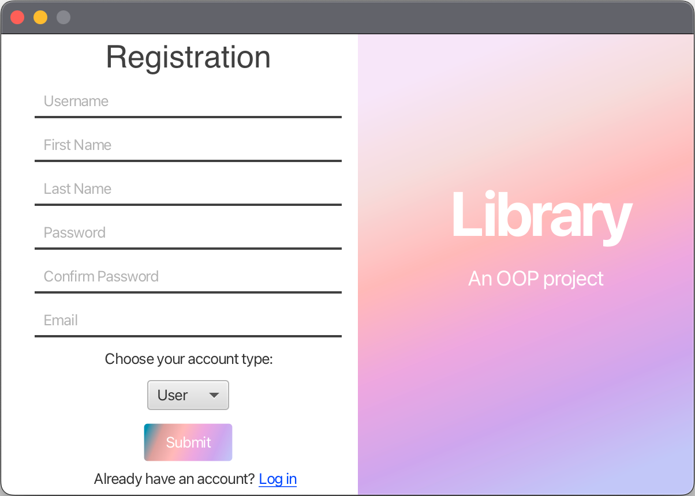
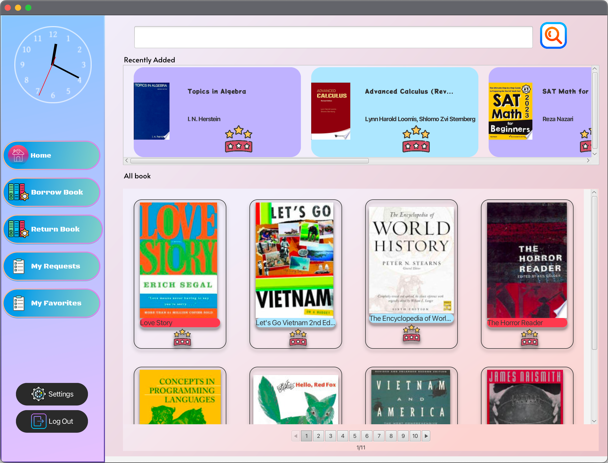
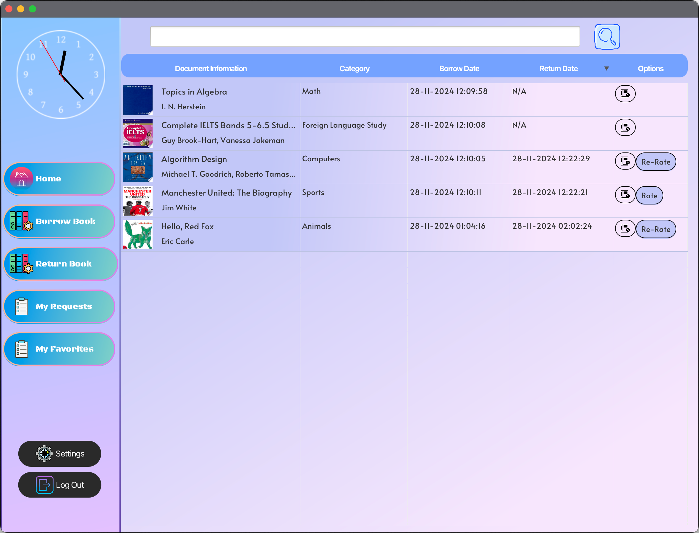
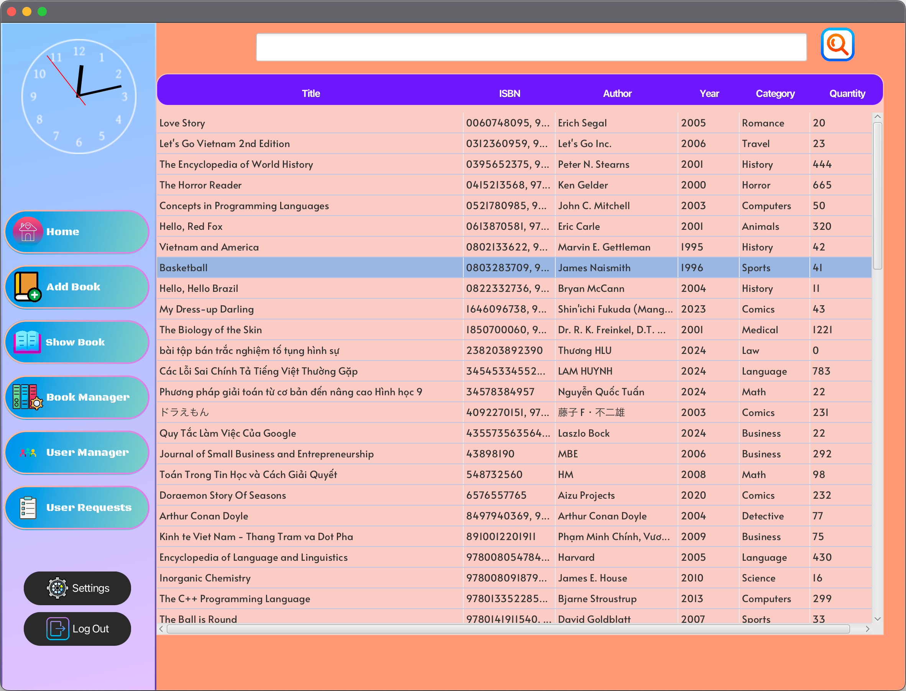
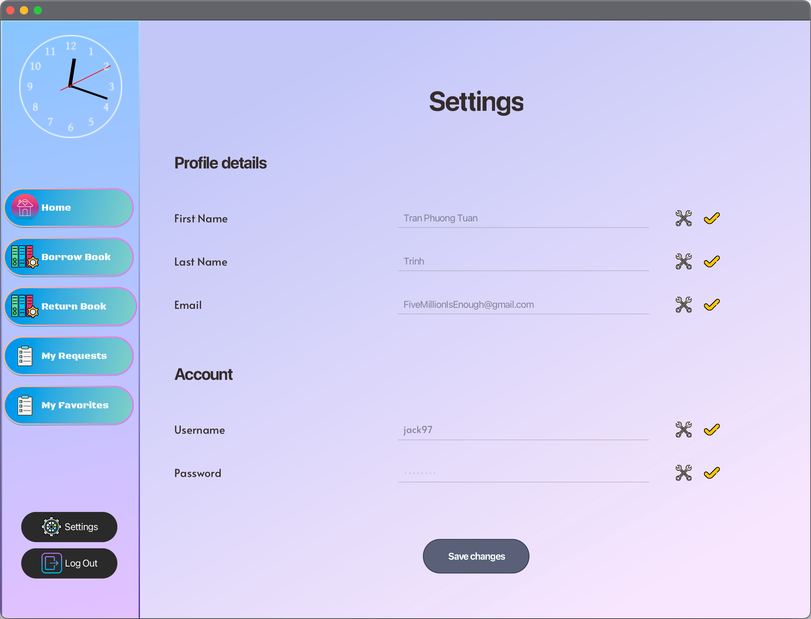

# Table of contents

* [Overview](#overview)
* [Getting started](#getting-started)
* [Screens and features](#screens-and-features)
  * [LogIn](#login)
  * [Register](#register)
  * [Side bar](#side-bar)
  * [User Features](#user-features)
    * [Home screen](#user-home-screen)
    * [Show book](#user-show-book)
    * [Favorites](#user-favorites)
    * [Borrow and Return Book](#user-borrow-and-return-book)
  * [Admin Features](#admin-features)
    * [Home screen](#admin-home-screen)
    * [Show book](#admin-show-book)
    * [Add Book](#admin-add-book)
    * [User Manager](#admin-user-manager)
    * [User Requests](#admin-user-requests)
  * [Setting](#setting)

---

# Overview

This is an online library application to support the real library. You can search and apply to borrow books, and when your request is approved, you can go directly to the library to borrow them. If unavailable, you can add them to your favorites to borrow later. You can also rate books with comments for the author and other readers.

---

# Getting started

To use the app, you need to:
- Download or clone the source code from this GitHub repository.
- Install JDK22 or later (JDK23 recommended).
- Install MySQL and add the MySQL Connector/J to the project.
- Create a database (you can export SQL code from [DBDiagram](https://dbdiagram.io/d/OOP-6704a091fb079c7ebdabcbcb)).
- Install the required dependencies and run.

---

# Screens and features

## LogIn

This screen appears when you open the app. You can log in with your username and password.

---

## Register

If you don't have an account, go to the register screen by clicking "register" at the bottom right. You can register as either an admin or a user.

---

## Side bar

  

    
    
<strong>User</strong>

  

  

    
    
<strong>Admin</strong>

  

---

## User Features

### Home screen

### Show book

### Favorites

### Borrow and Return Book
#### User Requests

#### User Return Book

---

## Admin Features

### Home screen

### Show book

### Add Book

### User Manager

### User Requests

---

## Setting

